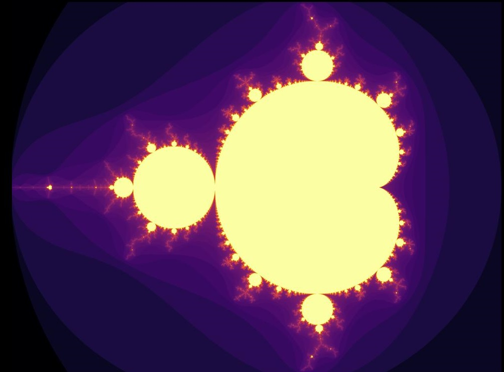
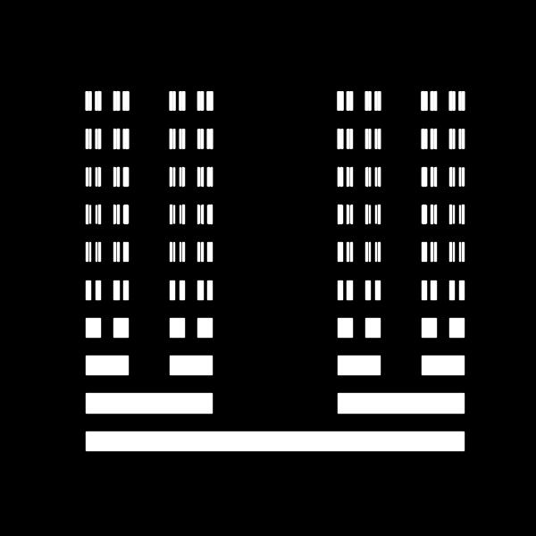

# Fractals

This repository contains some of the most popular fractals and my crude implementations of them.

## List of fractals
- [X] Mandelbrot set
- [X] Julia set
- [X] Cantor set
- [X] Sierpinski triangle
- [X] Koch snowflake
- [X] Pythagoras tree
- [X] Burning ship fractal
- [X] Barnsley fern
- [X] Dragon curve
- [X] Sierpinski carpet
- [X] Apollonian Gasket
- [X] Devil's staircase

---
### Mandelbrot set

    

### Julia set

    

### Cantor set

    

### Sierpinski triangle

    

### Koch snowflake

    

### Pythagoras tree

    

### Burning ship fractal

    

### Barnsley fern

    

### Dragon curve

    

### Sierpinski carpet

    

### Apollonian gasket

    

### Devil's staircase

    

